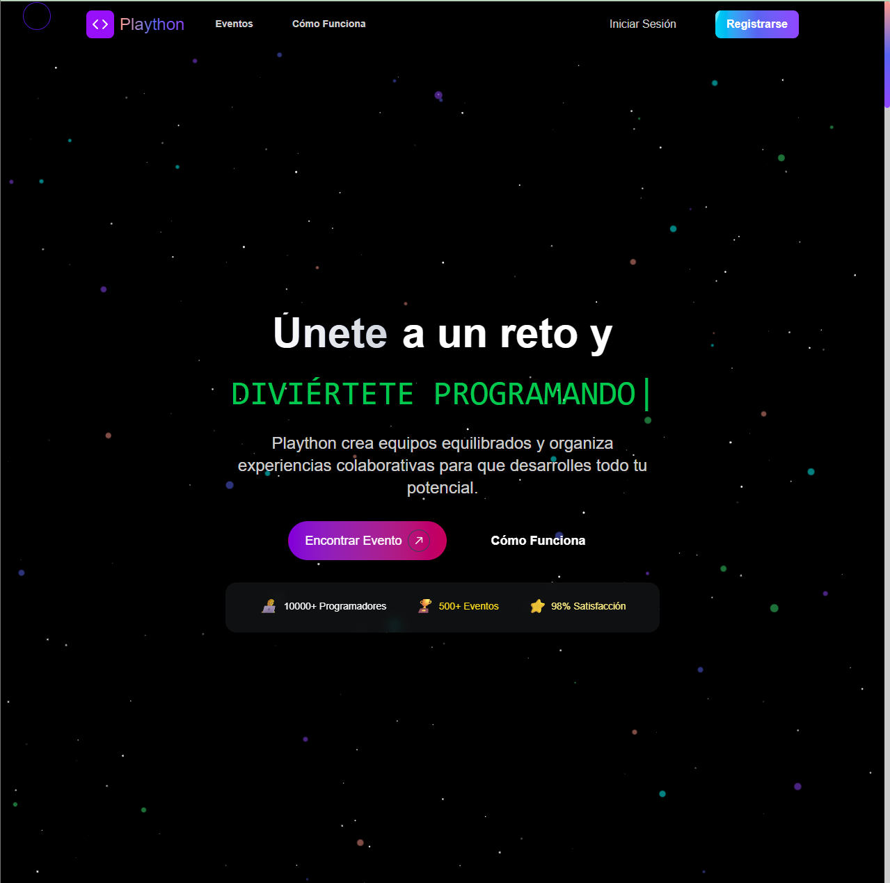

# Plaython 🚀

¡Únete a un reto y diviértete programando! 🤖

Plaython es una plataforma de matchmaking para retos y eventos de programación. 
Conecta a profesionales de distintas especialidades, forma equipos balanceados y coordina actividades. 
Su algoritmo inteligente optimiza la asignación de roles y la planificación de tareas, asegurando colaboraciones exitosas en hackathons y codeathons.

## 📝 Descripción del proyecto

Plaython facilita la organización de eventos de programación mediante:

Registro y autenticación de usuarios a través de Clerk 🔐

Gestión de retos y equipos colaborativos

Planificación de tareas y roles dentro de los equipos

Notificaciones en tiempo real y seguimiento del progreso


## 🔗 Demo en vivo

Visita la demo en Vercel para ver Plaython en acción:: [https://plaython.vercel.app/](https://plaython.vercel.app/)

## 🖼 Captura de pantalla



## 🔐 Integración con Clerk

Clerk se utiliza para la autenticación y gestión de usuarios:

Registro e inicio de sesión: Componentes de Clerk integrados en React para manejar flujos de autenticación.

Tokens JWT: Clerk emite JSON Web Tokens para autenticar solicitudes al backend.

Protección de rutas: Middleware de Clerk asegura que solo usuarios autenticados accedan a rutas sensibles.

Contexto de usuario: useUser() de Clerk proporciona datos del usuario en toda la app.

## ⚙️ Instalación y configuración

Sigue estos pasos para ejecutar Plaython localmente:

Clona el repositorio:

```
git clone https://github.com/Smiithx/Plaython.git
cd Plaython
```

Copia el archivo de entorno:
```
cp .env.example .env
```
Configura tus variables de entorno en el archivo .env:
```
NEXT_PUBLIC_CLERK_PUBLISHABLE_KEY="tu-clerk-publishable-key"
CLERK_SECRET_KEY="tu-clerk-secret-key"
NEXT_PUBLIC_SUPABASE_URL="https://tu-proyecto.supabase.co"
NEXT_PUBLIC_SUPABASE_ANON_KEY="tu-supabase-anon-key"
SUPABASE_SERVICE_ROLE_KEY="tu-supabase-service-role-key"
```
Instala dependencias:
```
npm install
```
Ejecuta migraciones de la base de datos:
```
npm run migrate
```
Carga datos iniciales (seed):
```
npm run seed
npm run seed:challenges (solo para desarrollo)
```
Arranca el servidor de desarrollo:
```
npm run dev
```
Abre http://localhost:3000 en tu navegador.

## 🧱 Tecnologías y estructura del proyecto

Tech Stack:

Frontend: React, Next.js, TypeScript, Tailwind CSS, Framer Motion

Autenticación: Clerk

Backend & DB: Supabase (PostgreSQL)

Animaciones: GSAP, Framer Motion

UI Components: Shadcn UI, Radix UI

Estructura principal:

```
plaython/
├── Components/         # Componentes de UI reutilizables
│   ├── ui/             # Componentes genéricos (botones, inputs...)
│   └── challenge/      # Componentes específicos de retos
├── src/
│   ├── app/            # Rutas y páginas de Next.js
│   ├── lib/            # Lógica de negocio y utilidades
│   ├── contexts/       # Contextos de React
│   └── hooks/          # Hooks personalizados
├── scripts/            # Migraciones y seeds de la base de datos
├── public/             # Recursos estáticos (imágenes, GIFs)
├── docs/               # Documentación adicional
└── __tests__/          # Pruebas unitarias (Jest)
```

## License

This project is licensed under the MIT License - see the LICENSE file for details.
